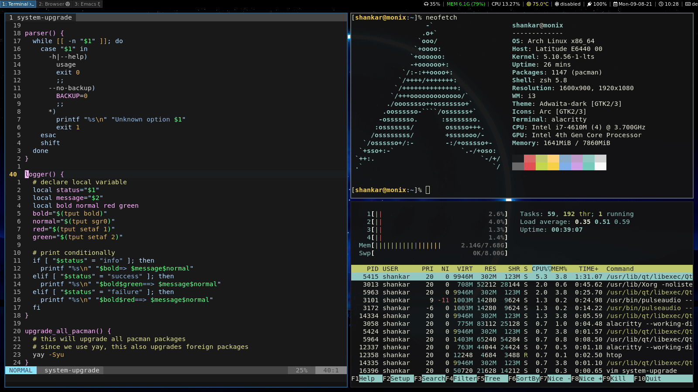

# dotfiles

This repository contains dotfiles for a minimal Arch Linux build called [`monix`](https://github.com/atreyasha/monix). Dotfiles include `i3-gaps`, `emacs`, `neomutt` and many more. Below is a screenshot of a sample workspace:

<p align="center">

</p>

## Initialization

Clone this repository in your `$HOME` directory. Next, pull all submodules and initialize a pre-commit hook by executing:

```
$ make init
```

## Installation

This repository uses [GNU Stow](https://www.gnu.org/software/stow/) for managing dotfiles and respective symbolic links.

To deploy all dotfiles, execute:

```
$ make install
```

To deploy an opinionated subset of dotfiles for a remote machine, execute:

```
$ make install.remote
```

## Test

To test the deployment of `dotfiles`, execute:

```
$ make test
```

## Uninstallation

To remove all stowed `dotfiles`, execute:

```
$ make uninstall
```

## Development

Check out our development [log](./docs/develop.md) for details on upcoming developments.
